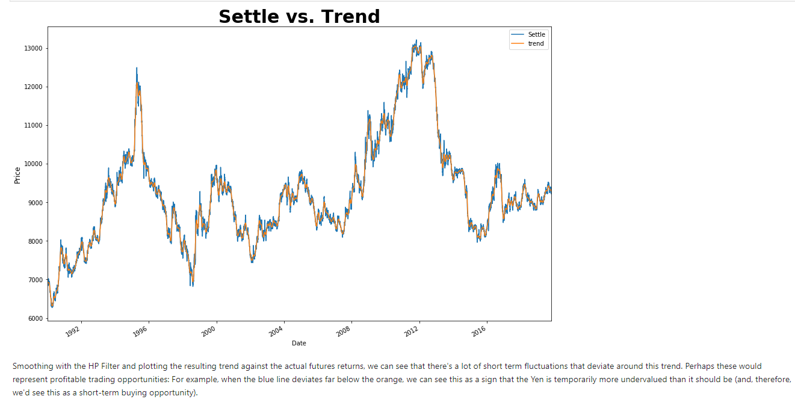
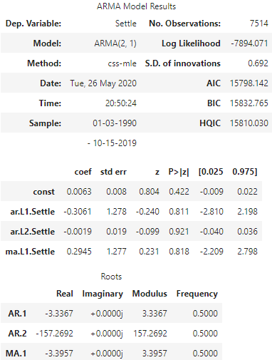
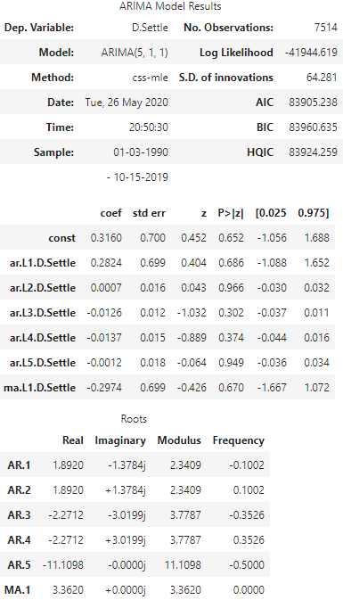

# A Yen for the Future: 
## Time Series Analysis and Linear Regression of the Yen Against the USD

This project evaluates the performance of various techniques applied in a time series forcasting for the historic values of the Japanese Yen (JPY) against the United States Dollar (USD). It also takes a look in evaluating the accuracy of future value predictions by using a Linear Regression of the JPY lagged returns. 

Summary of techniques used:

### Decomposition Using a Hodrick-Prescott Filter
Using a Hodrick-Prescott Filter, decompose the Settle price into a trend and noise. Plotting the smooth trend (orange) against the actual price (blue) reveals tradable opportunities. If the blue line falls below the orange, then we can conclude that the Yen is undervalued and can serve as a short-term buying opportunity.

Similar to the Trend, the noise also reveals buying and selling opportunity. Values above zero indicates to sell, while values below zero indicate to buy.

### ARMA 
This model makes value predictions based on the stationary nature of the data. Price fluctuations will generally have non-stationary behavior, so using the historical settle prices will not work. Therefore, by converting the data to daily percent change, we can transform it into stationary and evaluate its patterns. 

The Graph below demonstrates a five-day future prediction of the daily percent change of the Yen vs. USD. To simplify the process, the ARMA is composed of an autoregressive *"AR"* (p) model which predicts using previous values of the data's dependent variable while the moving average *"MA"* (q) model makes predictions using a series of mean and error metrics. 

### ARIMA
This forecasting model predicts the future values of the Yen's settle price for the next five days. Unlike the ARMA, the ARIMA model predicts by integrating seasonality fluctuations in the data. In ARIMA, the "I" (d) makes predictions based on seasonal changes in the data. If the model didn't have seasonal changes, then the ARMA model would be our only option. However, the graph below demonstrates that the model is non-stationary, meaning; it does have a trend over the year's quarters. 

### GARCH
GARCH allows us to predict the volatility associated with the future values of the Japanese Yen. The Graph below demonstrates that the volatility of the yen against the USD will increase within the next five days. This outcome is due to the drastic fluctuations in price throughout the years.

#### Conclusion For Time Series Analysis:

Based on the model evaluation, I would not feel confident in using these models for trading. The reason is because of the weak p-values that the ARMA and ARIMA models yield. Even if it was accurate, the GARCH model predicts that the volatility of the yen against the dollar will increase. Therefore, I would not make a trade regardless of the model's accuracy. If the models had better statistical performance, then I would trade considering that the model predicts the yen will appreciate in the next five days.

We must re-evaluate the model by either applying a different algorithm that will pick up patterns more accurately within the historical value data or use this algorithm to different types of data where it can pick up weaknesses in the market. 

### Linear Regression
This forecasting model takes the lagged returns of the Yen's settle price (training data) and makes predictions based on this information (testing data). Using the RMSE we were able to compare its performance.

Upon assessing this model with the square root mean sample error (RMSE), it is evident that it performs best with the out-of-sample data (data it has not seen before) yielding an RMSE of .4152, while the RMSE in the in-sample data (or training data) was .5658 upon calculation. This lower value for the out-of-sample indicates that testing data has a looser fit to the regression line than that of training data. Typically, the out-of-sample RMSE is higher than the training RMSE, but in this case, it is the other way around.
