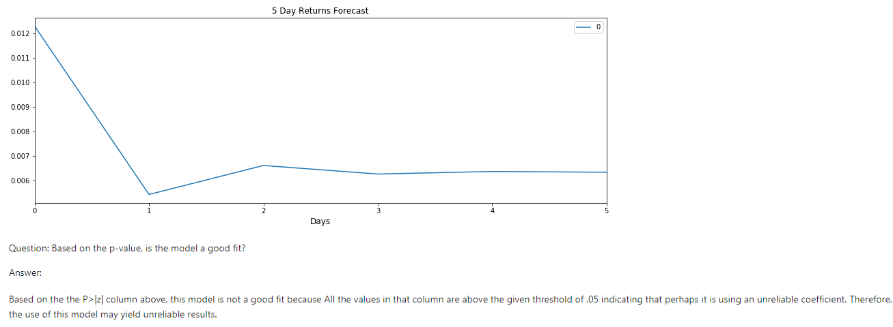
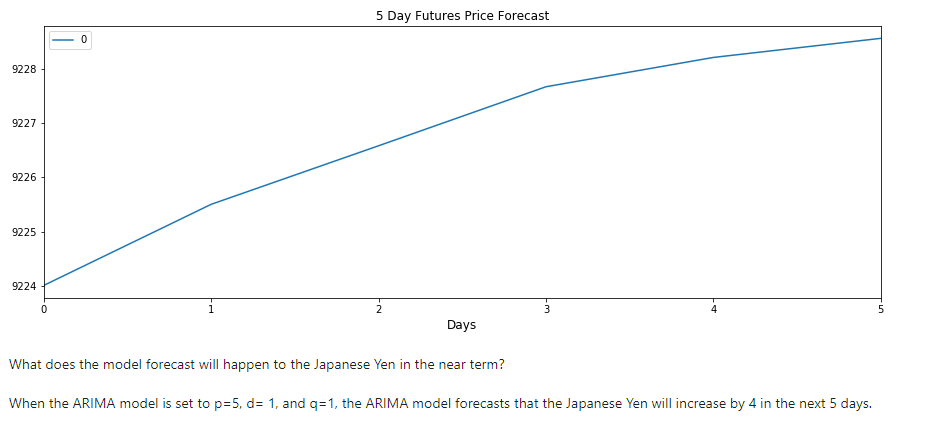
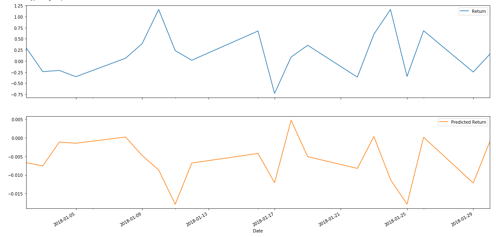

# A Yen for the Future: 
## Time Series Analysis and Linear Regression of the Yen Against the USD

This activity evaluates the performance of various techniques applied in a time series forcasting for the historic values of the Japanese Yen (JPY) against the United States Dollar (USD). It also takes a look in evaluating the accuracy of future value predictions by using a Linear Regression of the JPY lagged returns. 

Summary of techniques used:

### Decomposition Using a Hodrick-Prescott Filter
Using a Hodrick-Prescott Filter, decompose the Settle price into a trend and noise. Plotting the smooth trend (orange) against the actual price (blue) reveals tradable oportunities. If the the blue line falls below the the orange then we can conclude that the Yen is temporarily undervalued and therefore can serve as a short term buying opportunity.

Similar to the Trend, The noise also reveals buying and selling oportunity. Values above zero indicates to sell, while values below zero indicate to buy.

### ARMA 
This forecasting model makes future value predictions based on the stationary data of the settle prices. We used the yen's daily percent change in order to make a non-stationary data such as the Setttle price of the Yen into stationary (daily percent change). The Graph below demonstrates a 5-day future prediction of the daily percent change of the Yen vs USD.

### ARIMA
This forecasting model predicts the future values of the Yen's Settle price for the next 5 days. Unlike the ARMA, the ARIMA allows for non-stationary values to be used. In this case we used the actual settle price of the Yen.

### GARCH
GARCH allows us to predict the volatility associated with the future values of the Yen. The Graph below demonstrates that the volatility of the Yen against the USD will increase within the next 5 days. This can be due to the drastic fluctuations of price throughout the years.

#### Conclusion For Time Series Analysis:
Based on your time series analysis, would you buy the yen now?
Is the risk of the yen expected to increase or decrease?
Based on the model evaluation, would you feel confident in using these models for trading?

Based on the model evaluation I would not feel confident in using these models for trading. The reasoning behind this decision is based on the poor p-values that the ARMA and ARIMA models yield. On top of this issue, the GARCH model predicts that the volatility of the yen against the dollar will increase. Therefore, I would not make a decision based on this model. If the models had better statistical performance then I would certaintainly buy considering that the model predicts the yen will appreciate in the next 5 days.

### Linear Regression
In this 
This model performs best on the out-of-sample data (data it has not seen before) with a RMSE of .4152, a lower value than the in-sample data which yielded .5658 when calculated. The lower value in the out-of-sample indicates that training data has a closer fit to the regression line than that of testing data. Typically, the out-of-sample RMSE is higher than the training RMSE, but in this case it is the other way around.

